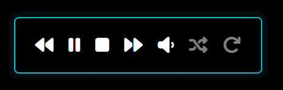

# MMM-SimplePlayer

This magic mirror module will enable the user to play music, control playback through a mouse or touchscreen and view details of the Track playing. 

Tracks can be played from either:
```
 	a local folder relative to the MagicMirror folder
 	a named playlist in a local folder, containing local tracks in folders relative to the requested musicDirectory, and/or from any streaming servers
 	a DLNA server available on the same network as the magicMirror
```

### Examples:

Screenshots of the Simple layout when music is playing<br>(Note, the MiniPlayer toggle is not shown except in the actual miniPlayer example. See config details)

<br>
Showing the default mini player playing
<br>
<BR>
<br>
Showing MetaData (Artist album track# and track title)
<br>
<BR>
Showing Event Viewer (used for debugging), and meta data.
<br>
<BR>
Showing DLNA server controls, DLNA server active and meta data. Server is called DiskStation and the track is playing from a previously saved local DLNA playlist. Album art is being shown.
<br>
<BR>

## Tracks

### Formats

As this module uses the HTML5 Audio tag supported in most modern browsers and Electron (the native Magimirror GUI) then only tracks of these types are supported: MP3, OGG, WAV. 

If the DLNA server includes tracks in other formats, it may have the ability to transcode to MP3. Check the DLNA Server options.

If tracks are in different formats, such as WMA, then use a conversion tool to create MP3 versions. VLC is a great free player that will also convert tracks from various formats to MP3.

### Security and track location

Modern browsers incorporate various security features that wont load tracks from "unSafe" locations. Different browsers (including Electron) have different interpretations of what is "unSafe" and so tracks in a location playable from one device/interface may be rejected in another combination. 

Some browsers will not Autoplay tracks when MM is first started. In this case, to play the first track, press play. After that, track changes will play automatically

If the tracks are on the MagicMirror server, then store them in a folder that is relative to the musicDirectory folderpath. The default location is in a music folder within the MMM-SimplePlayer folder within the modules folder of the MagicMirror implementation.

If using a playlist, then the tracks within the playlist should either refer to the same or similar folder within the MagicMirror folder structure and/or be streamed from a web server. DLNA servers make a good source as they can be anywhere on your network. 

### Playlist formats

Playlists in the standard m3u or m3u8 format are supported. For local tracks make sure that the track is referenced in a relative way (i.e. it shouldn’t start with \ or /) and that is is within the folder or a subfolder of musicDirectory config entry, see examples below.

If the tracks are from a webserver, then they should start with HTTP:// or HTTPS://

There are many tools available to build a standard playlist. Microsoft’s Legacy Media player (MMP) can easily add tracks from a DLNA server into a playlist, that can then be saved in m3u format to the MagicMirror server.

Currently SimplePlayer doesnt support internet radio playlists served by a DLNA server (they end in .pls or similar). A solution is being looked into.

### Example Playlist - from DLNA server, created using MMP

```
#EXTM3U
#EXTINF:0,34155.mp3?WMContentFeatures=DLNA.ORG_PN=MP3;DLNA.ORG_OP=01;DLNA.ORG_FLAGS=01700000000000000000000000000000&WMHME=1&WMDuration=4010000000&WMHMETitle=RABvAG4AJwB0ACAAVwBvAHIAcgB5AA==
http://199.169.9.99:50002/m/MP3/34155.mp3?WMContentFeatures=DLNA.ORG_PN=MP3;DLNA.ORG_OP=01;DLNA.ORG_FLAGS=01700000000000000000000000000000&WMHME=1&WMDuration=4010000000&WMHMETitle=RABvAG4AJwB0ACAAVwBvAHIAcgB5AA==

#EXTINF:0,34282.mp3?WMContentFeatures=DLNA.ORG_PN=MP3;DLNA.ORG_OP=01;DLNA.ORG_FLAGS=01700000000000000000000000000000&WMHME=1&WMDuration=2460000000&WMHMETitle=QgBlAGEAdAAgADUANAAgACgAQQBsAGwAIABHAG8AbwBkACAATgBvAHcAKQA=
http://199.169.9.99:50002/m/MP3/34282.mp3?WMContentFeatures=DLNA.ORG_PN=MP3;DLNA.ORG_OP=01;DLNA.ORG_FLAGS=01700000000000000000000000000000&WMHME=1&WMDuration=2460000000&WMHMETitle=QgBlAGEAdAAgADUANAAgACgAQQBsAGwAIABHAG8AbwBkACAATgBvAHcAKQA=
```

### Example Playlist - using local files

```
#EXTM3U
#EXTINF:0
track1.mp3
#EXTINF:0
track2.mp3
#EXTINF:0
track3.mp3
```

Note that in this example these tracks are in the folder indicated in the musicDirectory config value

## Module Installation and config options

### Dependencies

This module requires multiple modules, either included in the install or when npm install is run. Package.json contains details. Some Forks of modules are also included that have been enhanced specifially for SimplePlayer.

### Installation
To install the module, use your terminal to:
1. Navigate to your MagicMirror's modules folder. If you are using the default installation directory, use the command:<br />`cd ~/MagicMirror/modules`
2. Clone the module:<br />`git clone https://github.com/TheBodger/MMM-SimplePlayer`
3. cd to the folder:<br />`cd MMM-SimplePlayer`
4. Install dependencies:<br />`npm install`

### Update
to update this module, use your terminal to:
1. `cd ~/MagicMirror/modules/MMM-SimplePlayer`
2. `git pull`

### MagicMirror² Configuration

To use this module, add the following minimum configuration block to the modules array in the `config/config.js` file:
```js
		{
			module: "MMM-SimplePlayer",
			position: "top_left",
		},
```
This will show the Simple format of controls (as in example 1 above) which will play any valid tracks from the folder MMM-SimplePlayer/music

### Example Config

```js
{
	module: "MMM-SimplePlayer",
	position: "top_left",
	config: {
		autoplay: true, 
		playTracks: false, //Means either play from the directory or not, must be false to use the playlist
		musicDirectory: "modules/MMM-SimplePlayer/music",
		usePlaylist: true,
		playlistName: "examplePlaylist.m3u",
		showEvents: false,
		showMeta: true,
		startMuted: false,
	}
},
```
## Configuration Options

| Option                  | Details
|------------------------ |--------------
| `autoplay`                | *Optional* - if true, whenever a new track is requested (Next, Previous, First load of MM, DLNA playlist changes if enables and being used as music source) it will automatically start (see security and track location above)<br><br> **Possible values:** true/false.<br> **Default value:** false
| `playTracks`                | *Optional* - if true, the musicDirectory is searched for valid tracks, and available to play. Must be false to use the playlist option<br><br> **Possible values:** true/false.<br> **Default value:** true
| `musicDirectory`                | *Optional* - the musicDirectory contains a relative folder path to the MagicMirror main location which is searched for tracks, playlists, and any local tracks referenced in a playlist<br><br> **Possible values:** any valid relative folder path.<br> **Default value:** "modules/MMM-SimplePlayer/music"
| `usePlaylist`                | *Optional* - if true, the musicDirectory is searched for the named playlist and the tracks within it are made to play. <br><br> **Possible values:** true/false.<br> **Default value:** false
| `playlistName`                | *Optional* - the playlist to use, either m3u or m3u8 format<br><br> **Possible values:** any valid file name and type.<br> **Default value:** "examplePlaylist.m3u"
| `showEvents`                | *Optional* - if true, a window showing all events emitted from the player is displayed. Used primarily for debugging purposes <br><br> **Possible values:** true/false.<br> **Default value:** false
| `showMeta`                | *Optional* - if true, the meta data is loaded from the track and displayed: Artist - Album - Track# - Track title (unsupported format)<br><br> **Possible values:** true/false.<br> **Default value:** true
| `showAlbumArt`                | *Optional* - if true, displays any album art provided from the DLNA server above the main controls. Support for showing Art from other locations is being developed. <br><br> **Possible values:** true/false.<br> **Default value:** false
| `startMuted`                | *Optional* - if true, the volume is set to 0% (muted) when the module loads. Otherwise it is set to 50%<br><br> **Possible values:** true/false.<br> **Default value:** false
| `shuffle`                | *Optional* - if true, once the tracks are loaded from the folder or playlist, their order is shuffled (see controls). <br><br> **Possible values:** true/false.<br> **Default value:** false
| `repeat`                | *Optional* - if true, after the last track has ended, all tracks are repeated, in the order determined by any Shuffles (see controls). <br><br> **Possible values:** true/false.<br> **Default value:** false
| `DLNAPlaylistName`      | *Optional* - the name of the local DLNAplaylist the module will use to save and open from. This must have extension of m3u.<br><br> **Possible values:** any valid file name and type.<br> **Default value:** "dlnaPlaylist.m3u"
| `showDLNA`                | *Optional* - if true, shows the DLNA portion of the control panel. <br><br> **Possible values:** true/false.<br> **Default value:** false
| `supportedAudioExt`      | *Optional* - a list of music format extensions supported, currently 'MP3', 'WAV', 'OGG' used to filter tracks from a DLNA server. Any Tracks not matching these formats will be highlighted in the Meta Data area.. If in future the HTML audio player adds additional formats then these should be added to this list.<br><br> **Possible values:** List of supported audio type extensions.<br> **Default value:** ['MP3', 'WAV', 'OGG']
| `debug`                | *Optional* - if true, shows some additional messages in the consoles. <br><br> **Possible values:** true/false.<br> **Default value:** false		

## Controls
Showing DLNA available and being used as music source (it is bright)<BR>
<BR>
Showing that DLNA has not been enabled in the config / dimmed<BR>
<BR>

The playback controls from left to right in the example screenshot above are:
| Control                  | Details
|------------------------ |--------------
| `Previous Track`	| Loads the Previous track in the list, which will be the last track if the current track was the first track in the list
| `Pause\Play Track`		| Shows Play if the current track isnt playing (autoplay is off or the track has been Paused or Stopped). <BR><BR>Click to start playing from the current position within the track. <BR><BR>If the track is playing then shows Pause. <BR><BR>Click to pause the track, leaving it at the current position. <BR><BR>If meta data isnt required, then a border will appear around the controls that pulses when a track is playing (example vid above).
| `Stop Track`		| Click to stop the track playing, setting the current position to the start of the Track. 
| `Next Track`		| Loads the Next track in the list, which will be the first track if the current track was the last track in the list
| `Set Volume`		| Shows the current volume level.<BR><BR> Click to cycle through Muted, 50% of volume and 100% of volume.
| `(un)Shuffle Tracks`		| If dimmed the track list order is unshuffled, and they will play in the order found in the folder or playlist. <BR><BR>Click to shuffle the list into a random order. Order should be different each time the list is shuffled. After a shuffle, the next track played will be random and may be the same as the track playing when shuffled.<BR><BR> If highlighed, the list is shuffled<BR><BR>Click to unshuffle back to the original order. <BR><BR>If the shuffle config option is true, then after the tracks have been first loaded as the module starts, they will be then shuffled. 
| `Repeat Tracks (On/Off)`		| If dimmed, when the last track ends, playing stops.<BR><BR> Click to turn Repeat on<BR><BR> If highlighted, repeat is on. See the repeat option in config for details. <BR><BR> Click to turn repeat off.
| `DLNA source (On/Off)`		| If dimmed, the local tracks or playlist are used as source, if bright then the DLNA playlist is used. <BR>if DLNA has not been enabled in the config, a dimmed icon shows indicating it is not available.<BR><BR> Click to toggle between sources.

<BR>

The Text area immediately above the DLNA controls displays the current item within the Folder tree sent from the selected DLNA server. Some of the folders will be empty and this will be indicated with a message in the text area. 

If No DLNA servers is displayed, then check that the expected DLNA servers are running and visible across the network. Sometimes I found the Synology DLNA server testing was carried out on stopped responding and need to be restarted.

The DLNA controls from left to right in the example screenshot above are:
| Control                  | Details
|------------------------ |--------------
| `Scroll Down`	| Scrolls the display of the current DLNA list of folders/media (tracks, images, videos) down
| `Scroll Up`	| Scrolls the display of the current DLNA list of folders media up
| `Add Item`	| Adds all media in the current displayed folder and any subfolders to the DLNA playlist. If the item displayed is a media item then only that is added to the DLNA playlist. If the DLNA playlist is being used as source, then the new playlist is passed to the Player. 
| `Remove Item`	| Removes all media in the current displayed folder and any subfolders from the DLNA playlist. If the item displayed is a media item then only that is removed from the DLNA playlist. If the DLNA playlist is being used as source, then the new playlist is passed to the Player.
| `Clear DLNA playlist`	| Clears all entries from the current DLNA playlist and rescans for DLNA Servers. If new items have been added to the DLNA Server, then using this option ensures that the latest folders and media are shown. If the DLNA playlist is being used as source, then the new playlist is passed to the Player.
| `Save DLNA playlist`	| Saves the current DLNA playlist to the location specified in the config. Always overwrites whatever was there.
| `Open DLNA playlist`	| Loads the current DLNA playlist from the location specified in the config. Always overwrites whatever was there.
| `Scroll Left`	| Scrolls the display of the current DLNA list of folders/media left, showing the parent of the current item. If the displayed item is a server no more scrolling left occurs
| `Scroll Right`	| Scrolls the display of the current DLNA list of folders/media right, showing the child of the current item. If the displayed item is media no more scrolling right occurs

## Comments

As the simplePlayer always starts with either the local tracks or a local playlist, by entering the DLNA playlist name into the config option for playlistName then the previously saved DLNA playlist will start playing immediately.

If the behaviour of the module isn't as expected, check that folders and files are always within a folder path that includes the musicDirectory value, that the DLNA Server(s) are visible, and that the music is off a type supported by the HTML audio player (the supportedAudioExt config option default shows the type and the extension these files must be) If this does'nt resolve the problem, raise an error report in github with a copy of the config used, and details of the where the music is, track details and names, and how the MagicMirror is run and on what OS/platform.

Additional capabilities may be added, including showing all Album Images, supporting external control notifications and alternative controls layout.

Happy Listening
